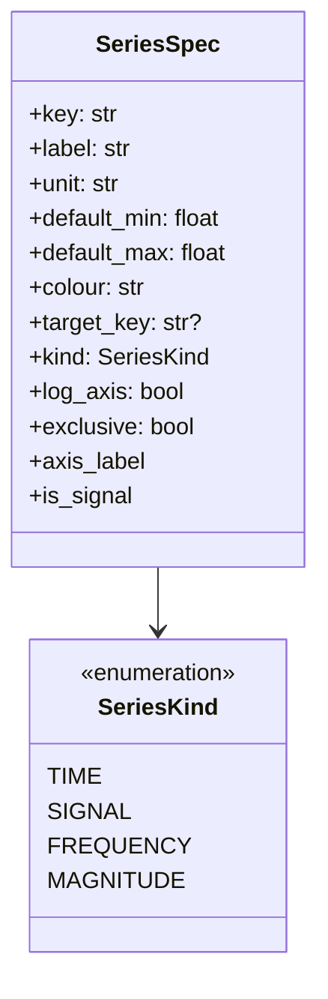
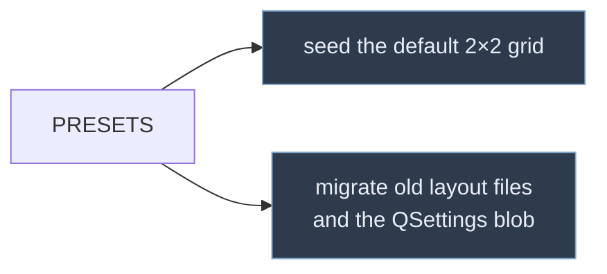

# `SeriesRegistry`

The catalogue of everything that can be plotted. This is the module that
replaced the old `PlotsSpec.py`.

The difference is the unit of description. `PlotsSpec` described **plots** — 23
named entries, each a nested dictionary of curves, axis bounds, target names and
behavioural flags. `SeriesRegistry` describes **series**, and a plot is any
combination of them chosen by the user. See
[`ui/plot/README.md`](ui/plot/README.md) for how that combination is turned into
a drawing.

**This module must stay free of Qt and pyqtgraph.** `mass_analyzer.py` imports
it for the colour constants and renders with matplotlib.

---

## `SeriesSpec`



| Field | Used for |
|---|---|
| `key` | The attribute name on `AudioFeatures` and `FeatureSnapshot`, or a synthetic name |
| `label`, `unit` | Selector entries, axis labels, plot titles |
| `default_min/max` | The range reset-zoom restores, and the spectrogram crop |
| `colour` | The series' points, when no colour dimension is set |
| `target_key` | Looked up in `TargetConfig.get_bounds()`; `None` means no target band |
| `kind` | Whether the series is real data or synthetic |
| `exclusive` | Whether the series can share an axis with others |

### Synthetic series

Three entries are not attributes of `AudioFeatures`. They exist so that the axis
selectors can express every kind of plot through one mechanism:

| Key | Meaning | Selecting it gives |
|---|---|---|
| `time` | The shared frame timebase | a time-scatter plot — on X normally, on Y transposed |
| `frequency` | `SpectrogramData.y` | a spectrum-slice plot (X only) |
| `magnitude` | A `magnitude_db` column at the playhead | (forced onto Y there) |

All three are `exclusive`; every real signal is not. That single flag is what
encodes "time cannot share an axis with pitch" without any special-casing in the
selector or the config.

### Ranges and targets

`default_min`/`default_max` were lifted from the corresponding `y_min`/`y_max`
in the old plot catalogue, so reset-zoom behaves as it did.

`target_key` is mostly the key itself, lowercased by `TargetConfig.get_bounds`,
but a few series deliberately share a target: `weight_instantaneous` and
`weight_333ms_max` both map to `weight`, and `pitch_5s_mean` maps to `pitch`.

`F1_Pitch_rel_amplitude` and its siblings are **not** in the registry. They are
declared on `AudioFeatures` but never assigned by the extractor and are absent
from `FeatureSnapshot` — work in progress, not plottable data.

---

## Presets

Presets are the only thing left of the old plot catalogue. They are a thin list
of saved combinations:

```python
PlotPreset(name="Formants", x=("time",), y=("F1", "F2", "F3"))
PlotPreset(name="Size vs Weight", x=("weight_instantaneous",), y=("size",),
           colour="loudness", trail_time=3.0)
PlotPreset(name="Spectrogram", x=("time",), y=(), spectrogram=True)
```

They have exactly two jobs:



**`PlotPreset.name` must stay identical to the corresponding key in the old
`PlotsSpec` dictionary.** Layout files written by earlier versions store that
name, and `PlotConfig.from_layout_entry` resolves it through
`PRESETS_BY_NAME`. Renaming one silently degrades those layouts to the default
plot.

Note that `Spectrogram` has an empty `y`. The standalone spectrogram is not a
special case in the code — it is simply a time plot with no Y series and the
background layer switched on.

---

## The self-check

`self_check()` — run it with `python src/SeriesRegistry.py` — asserts that:

- every `SIGNAL` series is an attribute of `AudioFeatures`
- every series named by a preset exists in the registry
- every colour dimension names a real series
- `DEFAULT_PRESET` is a preset

It catches the failure mode this design is most exposed to: a series renamed in
the analysis pipeline while the registry still names the old one, which would
otherwise surface as a plot that silently draws nothing.

---

## Adding a series

1. Add the field to `AudioFeatures`, and to `FeatureSnapshot` if it can be
   computed live.
2. Add a `_signal(...)` line to `SERIES`, in the position you want it to appear
   in the selectors.
3. If it has a target range, add the name to `TargetConfig` and set `target_key`.
4. Run `python src/SeriesRegistry.py`.

No plot definitions to update, and no change anywhere in `ui/plot` — the new
series appears in every X, Y and Colour selector automatically.
