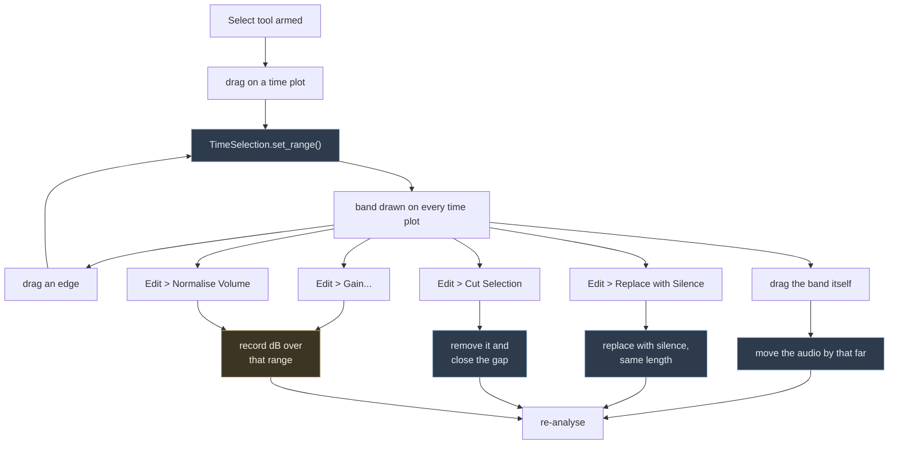
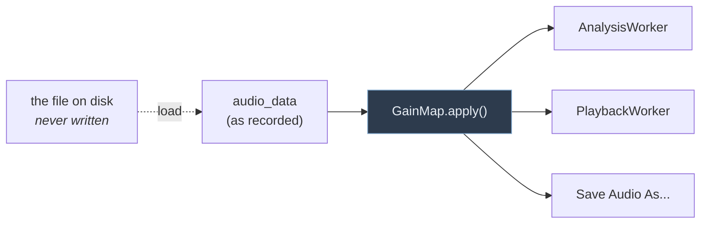

# Editing the audio

The user can pick out a stretch of the recording on any time plot and either
silence it or move it. Both act on the in-memory PCM buffer and are followed by
a re-analysis, exactly as finishing a recording is.

A **gain** is the odd one out: it is reached the same way, from the same menu,
over the same selection, but it never reaches the buffer -- it is applied to a
copy, on the way to whatever asked for the audio. See
[Gain](#gain-the-edit-that-is-not-one) below.

## The gesture

Dragging the **band** moves the audio; dragging an **edge** only adjusts the
selection. `SelectionLayer` tells them apart by comparing the span before and
after the drag — same length means the band was dragged bodily.

Leaving Select mode clears the selection, so an edit can never be applied to a
range the user can no longer see.

## Where the pieces live

| | |
|---|---|
| `signal_processing/AudioEdit.py` | `silence()`, `cut()` and `move()` on the byte buffer |
| `signal_processing/GainMap.py` | The gains in force, and applying them to a copy of the buffer |
| `ui/AudioHistory.py` | The undo and redo stacks |
| `ui/plot/TimeSelection.py` | The selected range; one per session, on the hub |
| `ui/plot/layers/SelectionLayer.py` | Draws the band, reports drags |
| `DirectionalViewBox` | `MODE_SELECT`, a drag tool alongside zoom and measure |
| `AnalysisWidget` | The Edit menu, and the re-analysis after an edit |

The transport and editing commands live in the **Edit** menu, between File and
Targets — `setupEditActions()` builds the actions, `setupMenu()` arranges them.
Play/pause also has a toolbar button, driven by the same action. Select is a
checkable action and takes part in the same mutual exclusion as the zoom and
measure buttons, through `_tool_toggles()`.

`R` starts and stops recording, `D` clears, and **space** starts and stops
playback — and stops a recording too, so whatever is running, space is what ends
it.

The selection lives on `PlotDataHub` because it is session state, like the data
and the clock — unlike frequency markers, which are application-wide. It runs
across whichever axis is time, so it works on transposed plots too.

## What the operations do

**Silence** zeroes the samples in the range. The buffer keeps its length, so
everything after the edit stays where it was.

**Cut** removes them and closes the gap: the recording gets shorter and
everything after the cut moves earlier. The selection is dropped afterwards,
because the range no longer describes the same audio.

**Move** carries the samples to their new position, **overwriting** whatever was
there, and leaves silence behind. The chunk is copied before the source is
cleared, so nudging a selection slightly — an overlapping move — comes out
right. Dragging past the end grows the buffer rather than truncating the audio;
dragging entirely off the front is refused.

## Gain: the edit that is not one

`Edit > Gain...` asks for a level change in dB and records it against a range
of the recording — the selection if there is one, otherwise `0..inf`, which is
what "the whole recording" means here, so audio recorded onto the end later is
covered by the same gain. `GainMap` keeps those ranges non-overlapping: setting
a gain over a range replaces whatever was in force there, and 0 dB removes it.

Nothing in the buffer changes. The gains are applied to a *copy* on every path
out of it, all three through `AnalysisWidget._gained_audio()`:

So the user hears what the analysis measured, and an exported wav matches both.
Keeping the buffer at the recorded level is what makes the gain adjustable
rather than accumulating: re-applying is a new multiplication of the original
samples, not another one on top of the last. The chunk cache needs no special
handling either -- it keys on the audio it is handed, so a gain over one
stretch re-analyses that stretch and reuses the rest. The chunk read while
recording is gained on its way to the live analysis too, at the offset it
occupies in the recording.

A stream that is already playing was handed the level in force when it started,
so applying a gain stops playback; the next play picks the new level up.

A gain over a range describes *that audio*, so `cut()` and `move()` on the map
follow the buffer edit of the same name: a cut drops the gains over what it
removed and pulls later ones back with the audio, and a move carries them
along, overwriting whatever was in force where they land.

Applying a gain is not an undoable action — 0 dB is the way back. But an entry
in the undo history carries a copy of the map anyway, because a cut or a move
*does* change it, and putting the audio back has to put the gains back with it.

Samples driven past full scale are clamped, and the user is told once, when the
gain is applied.

### Normalise Volume

`Edit > Normalise Volume` sets that same gain without asking for a figure: the
one that puts the loudest sample over the range just below full scale.
`GainMap.normalising_gain()` reads the peak of the *recorded* samples over the
range -- which is what a gain multiplies -- so normalising replaces whatever
was in force there rather than compounding it, and a recording already too hot
is brought down as readily as a quiet one is lifted.

The ceiling is `NORMALISE_CEILING_DB`, a decibel below full scale: a waveform
that touches the rail reads as clipped, and the rounding back to 16-bit needs
somewhere to go. So no clipping warning follows -- this is the gain that stops
short of clipping. A silent range has no peak to work from and is left alone,
and a range that would need more than `GAIN_LIMIT_DB` is taken as far as a gain
goes, with the user told it fell short.

## Undo

`AudioHistory` keeps states, not commands: each entry is a copy of the whole
buffer as it was *before* an action, which makes recording and clearing
undoable on the same footing as an edit without either having to describe how
to reverse itself. It keeps 30 steps or 256 MB, whichever runs out first,
dropping the oldest. Each entry carries the file path and the gains in force at
that moment as well, so stepping back restores the whole picture.

The Undo and Redo menu entries are labelled with what they would undo or redo —
`AnalysisWidget._on_history_changed()` renames them whenever the stacks change.
