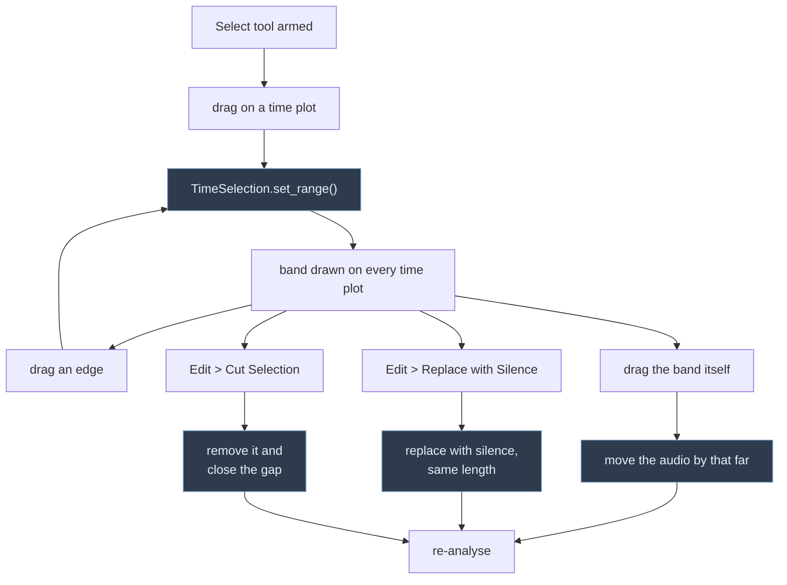

# Editing the audio

The user can pick out a stretch of the recording on any time plot and either
silence it or move it. Both act on the in-memory PCM buffer and are followed by
a re-analysis, exactly as finishing a recording is.

## The gesture

Dragging the **band** moves the audio; dragging an **edge** only adjusts the
selection. `SelectionLayer` tells them apart by comparing the span before and
after the drag — same length means the band was dragged bodily.

Leaving Select mode clears the selection, so an edit can never be applied to a
range the user can no longer see.

## Where the pieces live

| | |
|---|---|
| `signal_processing/AudioEdit.py` | `silence()`, `cut()` and `move()` on the byte buffer |
| `ui/AudioHistory.py` | The undo and redo stacks |
| `ui/plot/TimeSelection.py` | The selected range; one per session, on the hub |
| `ui/plot/layers/SelectionLayer.py` | Draws the band, reports drags |
| `DirectionalViewBox` | `MODE_SELECT`, a drag tool alongside zoom and measure |
| `AnalysisWidget` | The Edit menu, and the re-analysis after an edit |

The transport and editing commands live in the **Edit** menu, between File and
Targets — `setupEditActions()` builds the actions, `setupMenu()` arranges them.
Play/pause also has a toolbar button, driven by the same action. Select is a
checkable action and takes part in the same mutual exclusion as the zoom and
measure buttons, through `_tool_toggles()`.

`R` starts and stops recording, `D` clears, and **space** starts and stops
playback — and stops a recording too, so whatever is running, space is what ends
it.

The selection lives on `PlotDataHub` because it is session state, like the data
and the clock — unlike frequency markers, which are application-wide. It runs
across whichever axis is time, so it works on transposed plots too.

## What the operations do

**Silence** zeroes the samples in the range. The buffer keeps its length, so
everything after the edit stays where it was.

**Cut** removes them and closes the gap: the recording gets shorter and
everything after the cut moves earlier. The selection is dropped afterwards,
because the range no longer describes the same audio.

**Move** carries the samples to their new position, **overwriting** whatever was
there, and leaves silence behind. The chunk is copied before the source is
cleared, so nudging a selection slightly — an overlapping move — comes out
right. Dragging past the end grows the buffer rather than truncating the audio;
dragging entirely off the front is refused.

## Not implemented: undo

These edits are destructive and there is no undo. Recovering a mistake means
re-loading the file, and a mistake on an unsaved recording cannot be recovered
at all. A single-level undo would be cheap — keep a copy of the buffer before
each edit — and is the obvious next thing to add.
