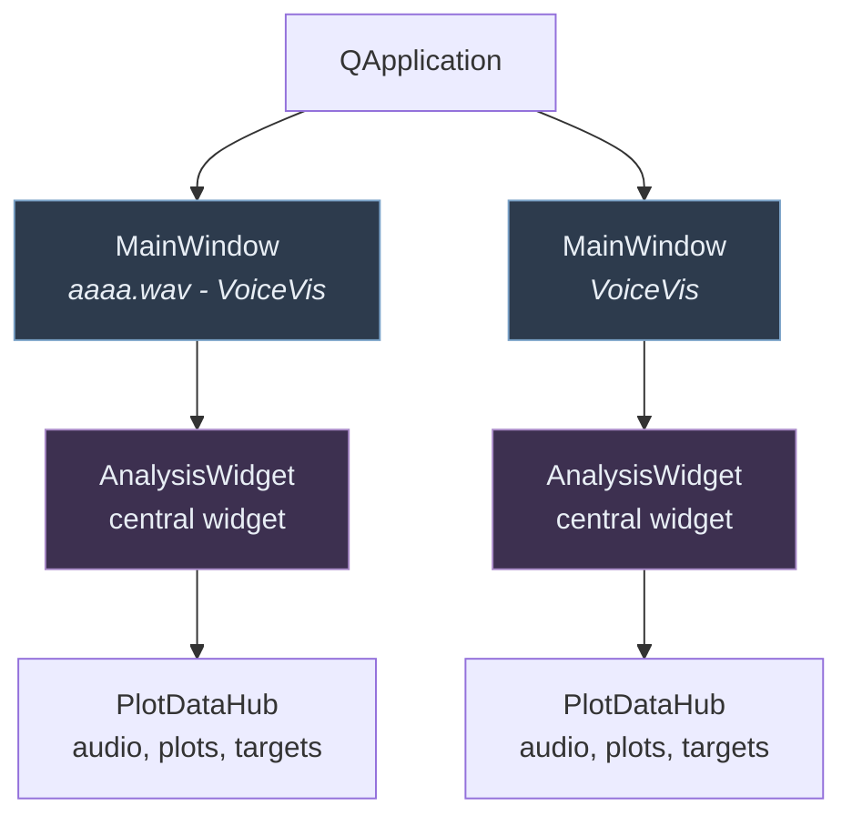
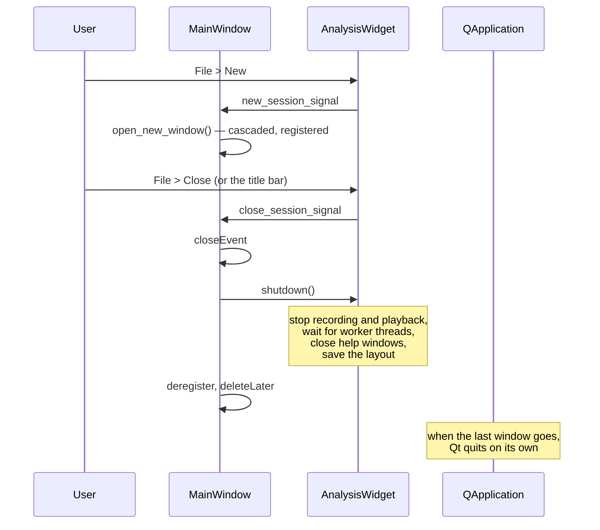

# Windows and sessions

**One session per window.** A `MainWindow` holds exactly one `AnalysisWidget` as
its central widget, and File > New opens another window rather than another tab.

Sessions share nothing: each has its own audio buffer, analysis, plot grid and
target configuration.

This replaced a model in which one window held several `AnalysisWidget`s inside
tabbed `QDockWidget`s. Separate top-level windows can be put on separate
monitors, which tabs could not, and the window itself becomes the unit of
"a recording I am working on".

## Lifecycle

Three details worth knowing:

**`_open_windows` is what keeps windows alive.** A top-level widget with no
parent is garbage collected as soon as the last Python reference goes away, so
the class-level list is load-bearing, not bookkeeping.

**Each session saves its layout in `shutdown()`, not on `aboutToQuit`.** An
application-level connection outlives the widget it belongs to; firing it after
a window has closed would reach a deleted C++ object. The consequence is that
the *last window closed* is the layout restored next time.

**Closing a window does not start a re-analysis.** `AnalysisWidget.record_stop`
splits into `_teardown_recording` (release the microphone, stop the live worker)
and the batch re-analysis that normally follows it. Shutdown calls only the
first half.

## Errors

`sys.excepthook` points at the module-level `report_exception`, which finds the
active window and emits its `show_error_signal`. Emitting rather than
constructing the dialog directly guarantees it is built on the GUI thread even
when the exception came from a worker. Routing through the *active* window
matters now that there can be several — a handler bound to one particular window
would outlive it.
