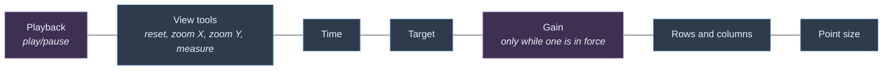
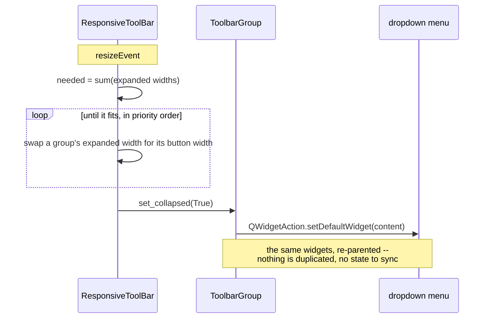

# The main toolbar

The controls above the plot grid are grouped, and each group folds into a
dropdown when the window is too narrow to hold it. That is what lets the window
scale down: the row needs about 1050 px with everything inline, and about 340 px
with everything folded.

## Folding order

Groups fold least-important first, so what disappears is what you are least
likely to be reaching for mid-recording:

| Order | Group |
|---|---|
| 1 | Point size |
| 2 | Rows and columns |
| 3 | Target |
| 4 | Time |
| 5 | View tools |
| — | **Playback never folds** — it is what the application is for |
| — | **Gain never folds** — it is empty unless a gain is in force, and a dropdown button for nothing would be worse than the label it replaced |

The rest of the transport — record, clear, and the audio edits — is in the Edit
menu; see [AudioEditing.md](AudioEditing.md). Play/pause is on the toolbar as
well because it is reached far too often to sit behind a menu. The button drives
the menu's `QAction`, so the two cannot disagree about play versus pause.

## How a group folds

The controls live on a single `content` widget. Folding moves *that container*
into the dropdown as a `QWidgetAction`, and unfolding releases it back into the
row.

Moving the container rather than rebuilding equivalent menu entries means the
widgets, their values and their signal connections are untouched: the point-size
slider inside the dropdown is the very same slider, and still drives every plot.

`_relayout` compares the wanted state against the current one and returns early
when they match, so the resize it causes cannot feed back into another fold.

A resize is the usual reason to re-fit, but not the only one: the gain readout
appears and disappears with the gain itself, which changes what has to fit
without the toolbar being resized at all. `refit()` is how the owner says so —
without it the row keeps its old plan and squeezes the labels instead of folding
a group ("Columns:" losing its last letters was how this was found).

## Measuring

`expanded_width()` reads the content's size hint, which stays valid while the
group is folded — so the toolbar can always tell whether a group would fit again.

`ResponsiveToolBar.sizeHint` deliberately reports the **folded** width. Reporting
the inline width would make the layout refuse to shrink the window at all, which
is the thing this exists to fix.

Its vertical size policy is **Fixed**. With the default `Preferred`, the toolbar
and the plot area both merely *prefer* their heights, so Qt hands each a share of
any spare vertical space -- maximising the window stretched the toolbar to 511 px
instead of giving the height to the plots. The plot splitter also carries the
layout's stretch factor, so spare height has somewhere to go.

A group's horizontal size policy is **Maximum**: it takes the width it asks for
and no more. An expanding child -- a `QLineEdit`, a slider -- otherwise makes the
whole group expanding, and the row's spare width is drawn into the group. The
field cannot use it (its width is fixed), so it lands on the label instead,
leaving "Time:" stranded a few hundred pixels from the box it names. Slack
belongs to the stretches between groups.

Text metrics differ between platforms, so tests must derive widths from
`expanded_width()` rather than hard-coding pixels: the same window is roomy on
one platform and already folding on another.
