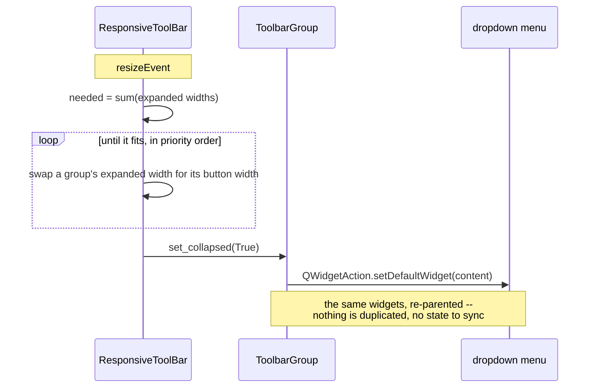

# The main toolbar

The controls above the plot grid are grouped, and each group folds into a
dropdown when the window is too narrow to hold it. That is what lets the window
scale down: the row needs about 1050 px with everything inline, and about 340 px
with everything folded.

## Folding order

Groups fold least-important first, so what disappears is what you are least
likely to be reaching for mid-recording:

| Order | Group |
|---|---|
| 1 | Point size |
| 2 | Rows and columns |
| 3 | Target |
| 4 | Time |
| 5 | View tools |
| — | **Transport never folds** — it is what the application is for |

## How a group folds

The controls live on a single `content` widget. Folding moves *that container*
into the dropdown as a `QWidgetAction`, and unfolding releases it back into the
row.

Moving the container rather than rebuilding equivalent menu entries means the
widgets, their values and their signal connections are untouched: the point-size
slider inside the dropdown is the very same slider, and still drives every plot.

`_relayout` compares the wanted state against the current one and returns early
when they match, so the resize it causes cannot feed back into another fold.

## Measuring

`expanded_width()` reads the content's size hint, which stays valid while the
group is folded — so the toolbar can always tell whether a group would fit again.

`ResponsiveToolBar.sizeHint` deliberately reports the **folded** width. Reporting
the inline width would make the layout refuse to shrink the window at all, which
is the thing this exists to fix.

Text metrics differ between platforms, so tests must derive widths from
`expanded_width()` rather than hard-coding pixels: the same window is roomy on
one platform and already folding on another.
