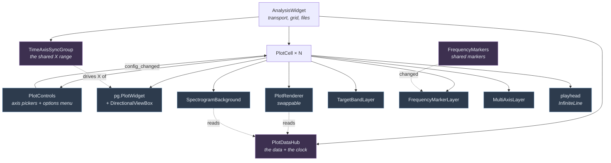
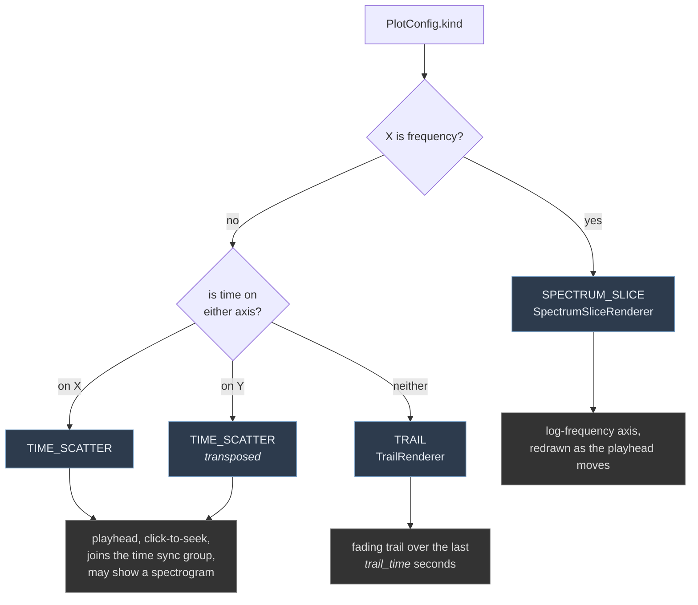
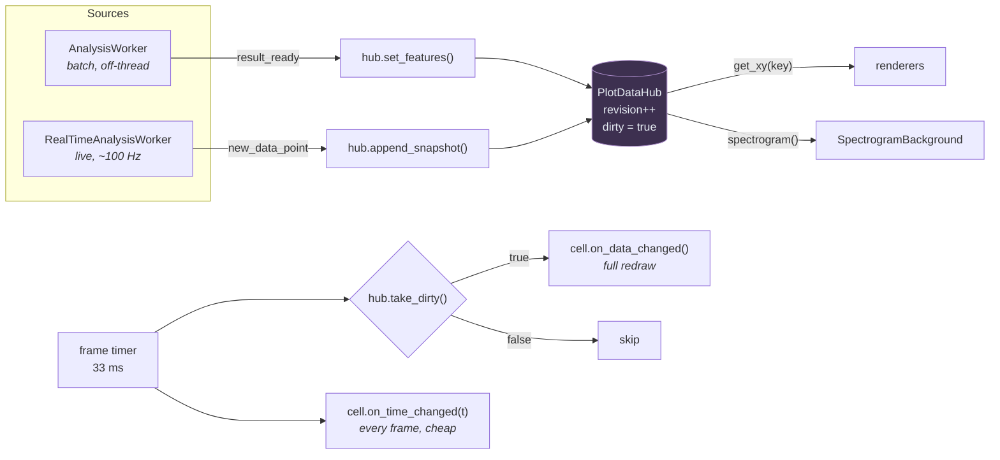
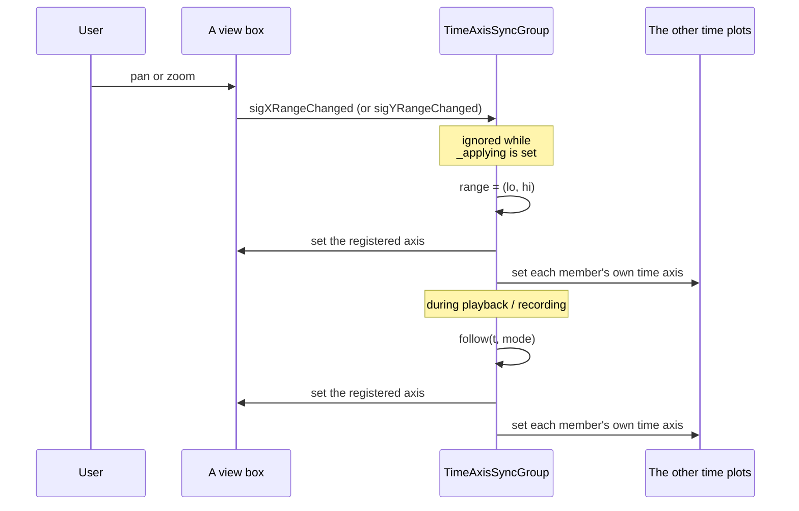
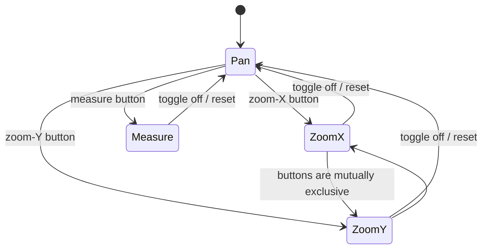
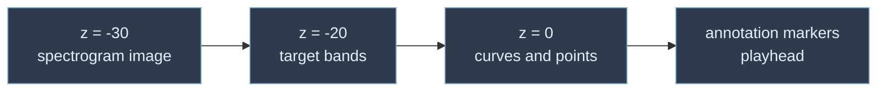
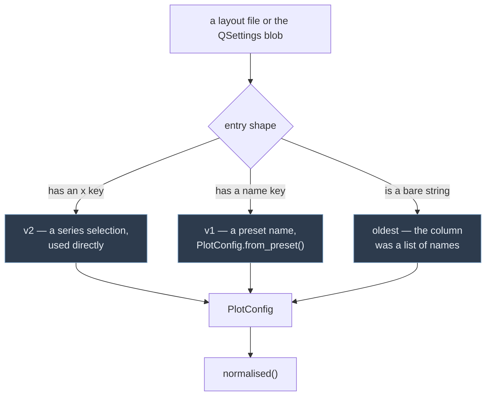

# The plot layer

Everything that draws a graph lives here. This document explains how the pieces
fit together and why the structure is the way it is.

Related documents:

- [`../../SeriesRegistry.md`](../../SeriesRegistry.md) — what can be plotted
- [`renderers/README.md`](renderers/README.md) — the drawing strategies
- [`layers/README.md`](layers/README.md) — the spectrogram, target-band and frequency-marker overlays

---

## The core idea

A plot is **not** a fixed thing with a name. A plot is a *choice of series*:

```
PlotConfig(x=["time"], y=["F1", "F2", "F3"], colour=None, spectrogram=True)
```

Everything else follows from that choice. What kind of plot it is, whether a
playhead makes sense, whether clicking should seek, whether it joins the shared
time axis — all derived, never stored and never chosen separately.

This replaced an earlier design in which each kind of plot was a different
class (`PlotController`, `InstantaneousPlotController`,
`FrequencyPlotController`) selected by dispatching on flags in a hard-coded
catalogue of 23 named plots. Because the kind lived in the *class*, changing
what a cell showed meant constructing a replacement widget and swapping it into
the splitter — which threw away the zoom state and orphaned any annotation
markers attached to the old plot.

---

## Who owns what



`PlotDataHub` and `TimeAxisSyncGroup` are shared by every cell. Everything under
a `PlotCell` belongs to that cell alone.

**The cell is never destroyed.** `PlotCell.apply_config()` swaps the renderer,
retargets the layers and relabels the axes in place. The widget keeps its slot
in the splitter, its annotations and — unless the series actually changed — its
zoom.

---

## How the kind is derived



Because the kind is a property of the data, a cell can move between all three by
changing a combo box.

### Time on either axis

`time` is offered on X and on Y. Selecting it on Y **transposes** the plot: the
value series run horizontally and time runs up the vertical axis. Everything
that has a direction follows: the time axis item moves to the left, the playhead
becomes horizontal, click-to-seek reads the Y coordinate, target bands become
vertical, the spectrogram image is drawn frequency-across/time-up, and the sync
group drives the Y range instead of the X range.

`PlotConfig` exposes this as `time_on_y`, `time_axis` (`'x'`, `'y'` or `None`)
and `value_keys()` — the series that are *not* the time axis. Code that cares
about "the quantities being plotted" should use `value_keys()`/`value_specs()`
rather than `y`, so it works in both orientations.

Time on both axes is not a thing, and `normalised()` drops the Y one.

---

## The rules a configuration must satisfy

`PlotConfig.normalised()` is total: it never raises and always returns something
renderable. It is applied on construction, on every edit and on every load.

| Rule | Reason |
|---|---|
| An `exclusive` series (`time`, `frequency`, `magnitude`) is alone on its axis | Time cannot share an axis with pitch |
| Time sits on at most one axis | Selecting it on both drops the Y one |
| At most one axis may hold several series | `y=[F1,F2,F3]` against `x=time` is meaningful; many-against-many is not |
| `colour` is kept only when both axes hold exactly one series | With several series each already uses its own registry colour |
| `spectrogram` only on `TIME_SCATTER`, and only when the value axis is empty or entirely in Hz | The image is drawn in true Hz; see [layers](layers/README.md) |
| `SPECTRUM_SLICE` forces `y = ["magnitude"]` | There is nothing else to put on that axis |
| An empty value axis is legal only with `spectrogram` | Otherwise the plot would be blank |
| `trail_time` is clamped to 0–60 s | |

`PlotControls` enforces the same rules *visibly*: when picking several X series
forces Y down to one, the Y button updates so the reduction is seen rather than
silently applied. Controls that cannot apply are disabled with a tooltip saying
why, instead of being hidden or silently ignored.

---

## The controls around a plot

```
   [Y label v] |  plot                     [=]
               |  [X label v]
```

**The axis pickers are the axis labels.** They sit where pyqtgraph would have
drawn "Pitch (Hz)", carry exactly that text, and open the series list when
clicked. pyqtgraph's own labels stay empty so the two cannot disagree.

The Y picker is drawn on its side, reading bottom-to-top like a conventional
axis label. Only the *painting* is rotated -- the widget keeps an ordinary
rectangle, so clicks, its menu and the layout all behave normally. Its size hint
is transposed; `minimumSizeHint` must then return that hint rather than
transposing again, since `QToolButton` derives one from the other.

Everything else lives in one options menu in the corner, keeping the space for
the plot itself:

| Entry | |
|---|---|
| Colour | Submenu of the series that may drive the colour dimension |
| Colour map | Which gradient that dimension runs through; disabled until one is chosen |
| Spectrogram | Background image; disabled unless the value axis is in Hz |
| Separate axis per series | See below; disabled with one series |
| Trail (s) | Only shown on a trail plot |
| Point size | The per-plot size slider |

`PlotControls` is a controller, not a widget: it owns the controls and the rules
they obey, and `PlotCell` decides where each one goes.

### Shared or separate axes

Several series on one axis normally share a range wide enough for all of them,
which squashes the smallest. `separate_axes` gives each its own scale, drawn as
an extra axis alongside — to the right normally, above on a transposed plot.

Each axis is then scaled to **its own data**, not to the registry range: F1, F2
and F3 all declare 0–3500, so falling back to those would make the option look
like it did nothing.

The extra axes are ordinary view boxes stacked over the plot's own and linked on
the axis that was *not* split, so panning and zooming time still moves
everything together. Moving an item between view boxes needs care: it is briefly
parentless, and pyqtgraph reacts by asking it to redraw, which with clipping on
raises `AttributeError: autoRangeEnabled`. `MultiAxisLayer._move` switches
clipping and downsampling off across the move.

---

## Data flow

`PlotDataHub` is the single owner of the analysed data and of the display time.
Nothing else holds a reference to a `SignalTimeSeries` — a re-analysis replaces
those objects wholesale, and cached references go stale silently.



### Two update paths, deliberately separate

| | `on_data_changed()` | `on_time_changed(t)` |
|---|---|---|
| When | Only when the data actually changed | Every frame |
| Time scatter | One `setData` per series | Move the playhead line |
| Trail | Re-cache, then redraw | Re-slice the trail window |
| Spectrum slice | Redraw | Pick the nearest column |
| Spectrogram | Rebuild the image (throttled) | — |

This split is the reason playback is cheap. The previous implementation bound
the 33 ms timer to a method that re-pushed **every curve's entire array for
every plot on every frame**. Now a playback frame across four plots holding 4000
points each costs about **0.04 ms**, because `take_dirty()` is false and nothing
calls `setData` at all.

Renderers additionally remember the revision they last drew, so a redundant
`on_data_changed()` is free.

### Colours

Series colours are user-editable, so renderers must call
`SeriesRegistry.colour_of(spec)` rather than reading `spec.colour` — see
[the registry](../../SeriesRegistry.md#the-palette). A colour change is not a
config change, so it goes through `PlotCell.refresh_colours()`, which rebuilds
the renderer's items and leaves the configuration and the zoom alone. The
palette is application-wide, so `MainWindow` fans the change out to every open
window.

A series used as a plot's *colour dimension* is unaffected by the palette: it
maps through the plot's colour map instead -- viridis, plasma or turbo, chosen
per plot and stored with the layout. `ColourMapping` owns both the set of maps
offered and the cache of resolved `pg.ColorMap` objects; every consumer passes
the name from `PlotConfig.colour_map`. Changing it *is* a config change, so it
goes through `apply_config` like any other, which rebuilds the renderer's items
and repaints the colour bar without disturbing the zoom.

The spectrogram background is deliberately not part of this: it is an image, not
a colour dimension, and stays viridis whatever the plot is set to.

### Live recording

`append_snapshot` is the only place in the application that appends a live
sample. Previously every visible curve in every cell appended the same snapshot
to the same shared series, so a feature shown in two plots was recorded twice.

Internally the hub switches each series to a capacity-doubling buffer for the
duration of the recording (`begin_recording` / `end_recording`), because
appending with `np.append` reallocates on every sample and makes a long
recording quadratic.

---

## Time-axis synchronisation

Every plot with a time axis shares one range, owned by `TimeAxisSyncGroup`.
Members register with the axis that actually carries time, so a transposed plot
joins the same group on its Y axis: zooming the time axis of any plot moves all
of them, whichever way round they are drawn.



A group rather than `setXLink`: the old code elected the first time plot in the
list as master and linked the rest to it. That election had to be redone on
every add, remove or reconfiguration, and had to be torn down if the master was
later switched to a non-time plot. A group is order-independent, survives
reconfiguration, and lets a zoom on *any* plot propagate to all the others.

`follow(t, mode)` also owns the scrolling behaviour:

| Mode | Behaviour |
|---|---|
| `recording` | A 10 s window with 1 s of space ahead of the playhead |
| `playing` | Keeps the current width; pages forward when the playhead passes 50 % of the view |
| `idle` | Does nothing |

Because the group owns the width, zooming during playback immediately changes
how far each page jumps.

---

## Mouse tools

`DirectionalViewBox` provides pan, single-axis rubber-band zoom, and a measure
tool. `AnalysisWidget` broadcasts the active mode to every cell.



Two subtleties worth knowing before touching this file:

**The axis lock lives in the drag handler, not in `setRange`.** An earlier
version overrode `setRange` and, whenever `zoom_axis` was `'y'`, replaced any
requested X range with the current one. `setXRange` funnels through `setRange`,
so for as long as the zoom-Y tool was armed *every programmatic X update was
silently discarded* — axis synchronisation, the recording window, playback
paging and reset-zoom all stopped working. Constraining inside `mouseDragEvent`
applies the lock only to user drags, which was the intent.

**Measure mode disables mouse interaction but still receives drag events.**
`setMouseEnabled(False, False)` suppresses the *effect* of the default handlers
while `mouseDragEvent` is still delivered. That ordering is what makes measuring
work; it is load-bearing and not obvious.

The readout is produced by a formatter supplied by the renderer, so a time plot
reports `Δt` in mm:ss and the spectrum plot converts its log-scaled axis back to
Hz.

**pyqtgraph's own "Plot Options" menu is disabled** (`setMenuEnabled(False, None)`);
the view box menu stays. That menu applies *Downsample* and *Clip to View* to
everything the plot tracks as a curve — including scatter items, which have
neither method, so ticking a box raised `AttributeError` on any trail plot. Its
other entries would also fight this module: log mode duplicates the manual
`x_transform`, and FFT and subtract-mean silently change what the data means.
`ScatterItem` additionally no-ops both methods, so the same calls arriving from
anywhere else stay harmless.

---

## Drawing order



This is what lets formant tracks be read against the harmonics behind them.

---

## Interaction with `AnalysisWidget`

The widget owns the transport (the playback clock, the audio buffer, the
recording state) and the grid of cells. It does **not** own the current time:
`AnalysisWidget.current_playback_time` is a property delegating to the hub.

Signals a cell emits upward:

| Signal | Meaning |
|---|---|
| `config_changed(cell)` | The selection changed; re-check sync-group membership and persist |
| `seek_requested(t)` | A click on a time plot. Non-time plots never emit this |
| `annotation_requested(cell, x, y)` | A double click on empty space |
| `annotation_clicked(cell, marker)` | A click within 15 px of an existing marker |

Methods the widget calls downward: `apply_config`, `on_data_changed`,
`on_time_changed`, `set_point_size`, `set_tool_mode`, `update_targets`,
`reset_zoom`, `apply_theme`, `dispose`.

There is exactly one construction path (`create_plot_cell`) and no per-kind
dispatch anywhere outside `PlotCell.RENDERERS`.

---

## Layout persistence

`LayoutSerializer` reads every layout format the application has ever written:



Anything unreadable falls back to the default plot **and logs a warning** —
silent substitution is how a user ends up reporting that their layout changed by
itself. The same applies inside an entry: an unknown `colour` or `colour_map`
is replaced by `normalised()` rather than failing the load.

`LAYOUT_VERSION` stays **2** for a purely additive optional key such as
`colour_map`. `load()` is shape-driven and never branches on `version`, and
every field is read with a default, so a v2 file written before the key existed
loads as viridis and an older build reading a newer file ignores the key.
Bumping the number would imply a migration branch that does not exist.

The `QSettings` key is deliberately unchanged (`AudioAnalyzer` /
`LiveMultiPlotWidget` / `last_active_layout`). Renaming it would have silently
discarded every existing user's saved layout. Old blobs are read, upgraded in
memory, and written back in the current schema.

---

## File map

| File | Responsibility |
|---|---|
| `PlotConfig.py` | What a plot shows; derives the kind; validates |
| `PlotCell.py` | The widget: bar + plot + renderer + layers; the only construction path |
| `PlotDataHub.py` | Owns the data and the clock; the only live-append path |
| `PlotControls.py` | The axis pickers and the options menu |
| `MultiSeriesSelector.py` | A drop-down that can check several series at once |
| `layers/MultiAxisLayer.py` | One scale per series instead of a shared axis |
| `TimeAxisSyncGroup.py` | The shared X range and the playhead-following behaviour |
| `DirectionalViewBox.py` | Pan, single-axis zoom, measure |
| `ScatterItem.py` | A scatter that tolerates `PlotItem`'s curve-wide settings |
| `FrequencyMarkers.py` | The shared set of marked frequencies |
| `PlotTheme.py` | Palette-derived colours; public pyqtgraph API only |
| `ColourMapping.py` | The selectable colour maps, normalisation and the colour bar |
| `../SeriesColourDialog.py` | Lets the user recolour series (View > Series colours...) |
| `TimeAxisItem.py` | mm:ss ticks, with precision following the zoom |
| `FrequencyAxisItem.py` | A curated log-frequency tick list |
| `LayoutSerializer.py` | Layout schema and migration |
| `renderers/` | The three drawing strategies — see [README](renderers/README.md) |
| `layers/` | Spectrogram, target bands and frequency markers — see [README](layers/README.md) |
