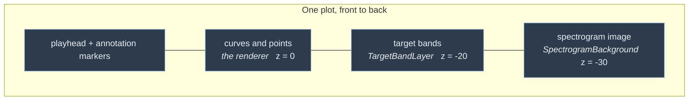
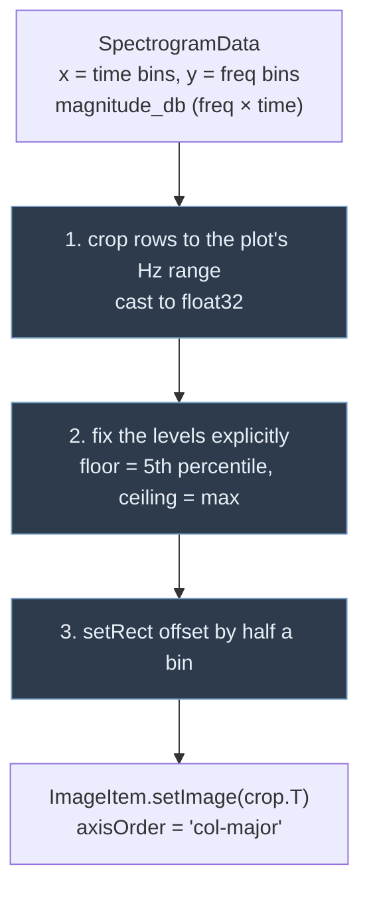
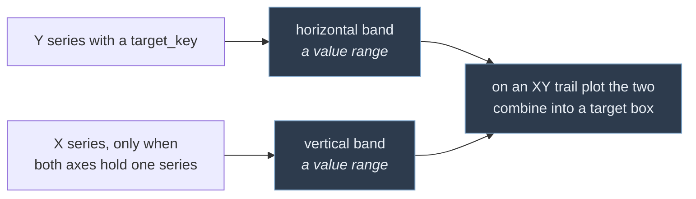

# Layers

Layers are overlays that any renderer can have. They are owned by the
`PlotCell`, not by the renderer, so they survive a renderer swap.

See [`../README.md`](../README.md) for how this fits into the whole layer.



---

## `SpectrogramBackground`

A viridis `pg.ImageItem` drawn behind the curves, so scatter points can be read
against the harmonics behind them.

This capability was **lost** when the original monolithic controller was split
into three classes: the plot catalogue still advertised an `is_spectrogram`
flag, but nothing created an `ImageItem` any more. Selecting the spectrogram
built an ordinary scatter and fed it the time bins as X against the frequency
bins as Y — two arrays of unrelated lengths.

### Coordinates

The image is drawn in **true Hz** on the Y axis, cropped to the plot's range —
not stretched to fill whatever range the plot happens to have.

That is a deliberate trade. On a plot whose Y axis is already in Hz (formants,
pitch) the image lines up exactly, which is the entire point. On a plot of, say,
Size (0–30) you would see 0–30 Hz, i.e. nothing useful. Stretching instead would
look like a background texture everywhere but would make the frequency scale a
lie.

So the cell **disables the spectrogram checkbox, with a tooltip**, unless every
Y series is in Hz or there is no Y series at all. The constraint is visible
rather than mysterious.

### Three traps, all of which the previous implementation hit



**1 — Cropping is not an optimisation, it is required.** At `nperseg=4096` /
`nfft=8192` the matrix is 4097 rows, with roughly 43 columns per second. A few
minutes of audio is hundreds of megabytes as float64 before the lookup table is
even applied. Cropping to 0–3500 Hz for a formant plot keeps 651 of 4097 rows.

**2 — Levels must be fixed.** With `autoLevels` the contrast rescales on every
update, which is very visible while recording. The recovered pre-split code had
no `setLevels` at all.

**3 — Bin values name the centre of their cell**, so the image starts half a bin
before the first one:

```
rect = QRectF(x[0] - dt/2,  y[0] - df/2,
              (x[-1] - x[0]) + dt,  (y[-1] - y[0]) + df)
```

The pre-split code anchored the rect at the origin, which shifted the whole
image by half a bin on both axes — and by the first bin's offset in time, which
is about 46 ms at 44.1 kHz.

Axis order is set per item (`col-major`, so the array is `[time, freq]` and the
data is transposed on upload) rather than relying on pyqtgraph's global
`imageAxisOrder` config, which any other code could change.

### When it redraws

Only when the hub revision or the visible frequency range has changed, and
during recording no more than every 200 ms. This is by far the heaviest thing
that can happen in the frame loop.

---

## `TargetBandLayer`

Shaded regions showing the target range of each plotted series, read from
`TargetConfig.get_bounds()` via each series' `target_key`.

All bands share one neutral translucent grey (`SeriesRegistry.target_band`) so
they stay in the background and do not compete with the series drawn over them.

Bands are keyed **by series**, not by the plot. A plot showing F1, F2 and F3
therefore gets three separate bands at three different heights; the previous
implementation keyed them off the plot spec and drew three identical bands
stacked on top of each other.



The vertical band is what turns a Size-vs-Weight plot into a proper target box
rather than a single horizontal stripe.

`set_series()` diffs against the bands already present, so reconfiguring a cell
creates and removes only what actually changed.
