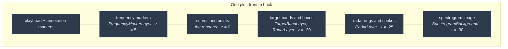
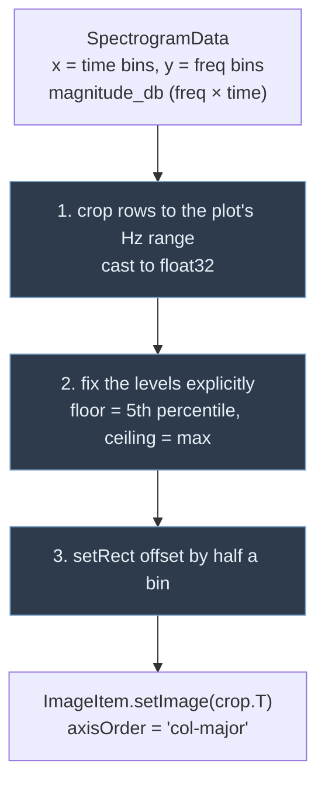
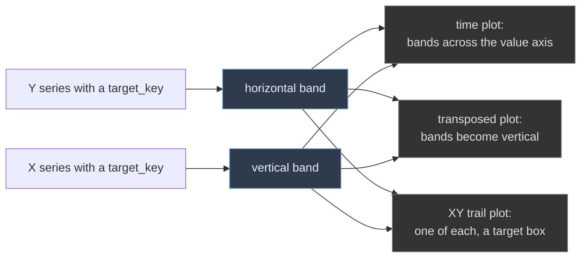
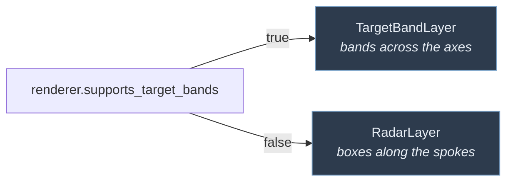
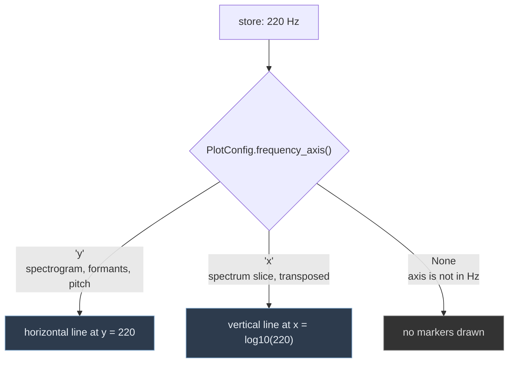

# Layers

Layers are overlays that any renderer can have. They are owned by the
`PlotCell`, not by the renderer, so they survive a renderer swap.

See [`../README.md`](../README.md) for how this fits into the whole layer.



Only one of `TargetBandLayer` and `RadarLayer` ever has anything in it: the cell
asks the renderer which of the two ways it wants targets drawn.

---

## `SpectrogramBackground`

A viridis `pg.ImageItem` drawn behind the curves, so scatter points can be read
against the harmonics behind them. Viridis unconditionally: the image is not a
colour dimension, so it does not follow the plot's `colour_map` choice.

This capability was **lost** when the original monolithic controller was split
into three classes: the plot catalogue still advertised an `is_spectrogram`
flag, but nothing created an `ImageItem` any more. Selecting the spectrogram
built an ordinary scatter and fed it the time bins as X against the frequency
bins as Y — two arrays of unrelated lengths.

### Coordinates

The image is drawn in **true Hz** on the value axis, cropped to the plot's
range — not stretched to fill whatever range the plot happens to have.

That is a deliberate trade. On a plot whose value axis is already in Hz
(formants, pitch) the image lines up exactly, which is the entire point. On a
plot of, say, Size (0–30) you would see 0–30 Hz, i.e. nothing useful. Stretching
instead would look like a background texture everywhere but would make the
frequency scale a lie.

So the cell **disables the spectrogram checkbox, with a tooltip**, unless every
value series is in Hz or there are none at all. The constraint is visible rather
than mysterious.

**Orientation.** When the plot is transposed — time on Y — the image is too:
frequency runs across and time runs up. `refresh(..., transposed=True)` skips
the array transpose (the data is already `[frequency, time]` for a `col-major`
upload) and swaps the two axes of the rect. The cached `_seen_transposed` is
part of the redraw guard, so flipping a plot rebuilds the image even though the
data has not changed.

### Three traps, all of which the previous implementation hit



**1 — Cropping is not an optimisation, it is required.** At `nperseg=4096` /
`nfft=8192` the matrix is 4097 rows, with roughly 43 columns per second. A few
minutes of audio is hundreds of megabytes as float64 before the lookup table is
even applied. Cropping to 0–3500 Hz for a formant plot keeps 651 of 4097 rows.

**2 — Levels must be fixed.** With `autoLevels` the contrast rescales on every
update, which is very visible while recording. The recovered pre-split code had
no `setLevels` at all.

**3 — Bin values name the centre of their cell**, so the image starts half a bin
before the first one:

```
rect = QRectF(x[0] - dt/2,  y[0] - df/2,
              (x[-1] - x[0]) + dt,  (y[-1] - y[0]) + df)
```

The pre-split code anchored the rect at the origin, which shifted the whole
image by half a bin on both axes — and by the first bin's offset in time, which
is about 46 ms at 44.1 kHz.

Axis order is set per item (`col-major`, so the array is `[time, freq]` and the
data is transposed on upload) rather than relying on pyqtgraph's global
`imageAxisOrder` config, which any other code could change.

### When it redraws

Only when the hub revision or the visible frequency range has changed, and
during recording no more than every 200 ms. This is by far the heaviest thing
that can happen in the frame loop.

---

## `TargetBandLayer`

Shaded regions showing the target range of each plotted series, read from
`TargetConfig.get_bounds()` via each series' `target_key`.

All bands share one neutral translucent grey (`SeriesRegistry.target_band`) so
they stay in the background and do not compete with the series drawn over them.

Bands are keyed **by series**, not by the plot. A plot showing F1, F2 and F3
therefore gets three separate bands at three different heights; the previous
implementation keyed them off the plot spec and drew three identical bands
stacked on top of each other.

The rule is simply: every series with a target gets a band across the axis
opposite its own.



No axis needs special-casing, because the series that *are* axes rather than
measurements — `time`, `frequency`, `magnitude` — carry no `target_key` and so
never produce a band. Transposing a plot therefore moves its bands from
horizontal to vertical with no extra code, and the vertical band is also what
turns a Size-vs-Weight trail plot into a proper target box rather than a single
horizontal stripe.

`set_series()` diffs against the bands already present, so reconfiguring a cell
creates and removes only what actually changed.

---

## `RadarLayer`

Everything a radar plot has instead of axes: the ring a series reaches at the
top of its range, the spoke it runs along, the numbered scale up that spoke, its
name, and the box marking its target range.
[`RadarRenderer`](../renderers/README.md#radarrenderer) draws only the values;
the two agree on where things go through
[`RadarGeometry`](../RadarGeometry.py).

The target box is why this is a layer rather than part of the renderer: it is
the same job `TargetBandLayer` does, done the only way that means anything when
the axes are not the quantities. A horizontal band across a radar would mark a
height in the drawing, not a range in pitch. So a box is drawn along the spoke
instead, from the target's minimum to its maximum, with the same neutral
`SeriesRegistry.target_band` fill every other target uses.



`PlotCell` feeds the empty selection to whichever of the two does not apply, so
only one ever holds items.

### The scales

Each spoke is marked at values off the 1/2/5 ladder, so the numbers printed are
ones a reader recognises rather than whatever an even division of the range
produced. Three details are deliberate:

- **The tick at the bottom of the range is dropped.** Every spoke meets at the
  centre, so all of them would print their minimum on top of each other.
- **The marks start where the target box ends** and reach a little further out,
  so the scale frames the box rather than running through the values inside it.
- **Both sides are marked and numbered.** The values sit between the two, so a
  scale down one side only would be the far side for half of the plot.

Each spoke's marks are one `SegmentItem`; the numbers are `TextItem`s in a
smaller font, in the series' own colour, so a scale is read together with the
spoke it belongs to.

### Why plain graphics items

The ring and the spokes are `QGraphicsPathItem`s with **cosmetic** pens, not
`PlotCurveItem`s. Two reasons, both of which bite quietly:

- `PlotItem` files anything implementing `plotData` under `self.curves` and then
  calls `setClipToView` and `setDownsampling` on the lot. `PlotCurveItem` has
  neither method — the same trap [`ScatterItem`](../ScatterItem.py) exists to
  neutralise. Not joining that list avoids it outright.
- A non-cosmetic pen is measured in data space, so a one-pixel ring would
  thicken as the plot was zoomed in. Cosmetic keeps the frame one pixel wide at
  every zoom, which is what a frame should be.

[`SegmentItem`](../SegmentItem.py) sidesteps both the same way, which is why the
scale marks use it as well as the values do.

The frame is rebuilt outright on a palette or theme change rather than being
diffed like `TargetBandLayer`'s bands: the spokes take their colour from the
series, and there are only a handful of items.

---

## `FrequencyMarkerLayer`

Draggable reference lines at frequencies the user marks — a target pitch, a
formant to aim for, a harmonic to watch.

Markers are held in one application-wide store
([`../FrequencyMarkers.py`](../FrequencyMarkers.py)), like the series palette:
220 Hz is 220 Hz everywhere. Adding one on the spectrogram makes it appear on
the spectrum slice and in every other open window, because each layer connects
to the store's `changed` signal directly.

### Orientation follows the plot, not the marker

The store holds bare frequencies. Which way a line is drawn — and where on the
axis it lands — is a property of the plot, from `PlotConfig.frequency_axis()`.



A spectrum slice holds **log10(Hz)** on its axis, so the layer is given the
renderer's `x_transform`/`x_inverse` rather than assuming axis coordinates are
frequencies. Both the drawn position and the value read back from a drag go
through that pair, so dragging a line on the log axis stores real Hz.

### Editing

| Action | How |
|---|---|
| Add | Right-click > *Frequency markers* > *Add marker at N Hz*, or *Add marker at...* to type one |
| Move | Drag the line, or right-click it > *Move N Hz to...* |
| Remove | Right-click the line > *Remove N Hz*, or *Remove all* |

The menu is rebuilt each time it opens, because its entries depend on where the
click landed — `DirectionalViewBox.raiseContextMenu` records that point, since
an action runs long after the click that opened the menu.

`_rebuild` reuses the existing lines and only creates or removes them when the
count changes. Replacing the line the user just let go of would otherwise
destroy an item mid-interaction. An `_applying` guard stops `setValue` during a
rebuild from looping back into the store through the drag signal.
