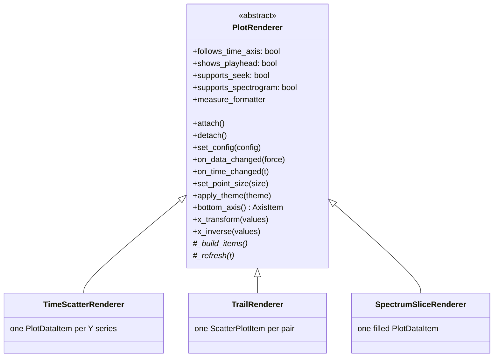
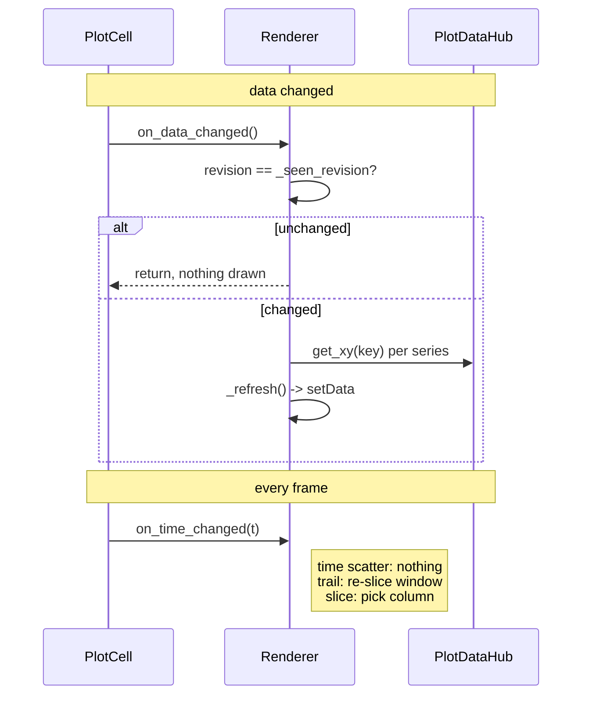

# Renderers

A renderer owns the pyqtgraph items inside one plot and knows how to fill them
from the [`PlotDataHub`](../PlotDataHub.py). `PlotCell` picks one from its
`PlotConfig` and swaps it when the kind changes.

See [`../README.md`](../README.md) for how this fits into the whole layer.



Subclasses implement `_build_items` and `_refresh`. The base class handles the
lifecycle, the revision guard, the colour bar and the viridis sampling.

---

## Capabilities

`PlotCell` reads these flags rather than asking what kind of renderer it has.

| | Time scatter | Trail | Spectrum slice |
|---|---|---|---|
| X axis | time | a feature | frequency (log) |
| Y axis | 1–N features | a feature | magnitude |
| `follows_time_axis` | yes | no | no |
| `shows_playhead` | yes | no | no |
| `supports_seek` | yes | no | no |
| `supports_spectrogram` | yes | no | no |
| Bottom axis | `TimeAxisItem` | plain | `FrequencyAxisItem` |
| Redrawn per frame | no | yes | yes |

`supports_seek` is why clicking the trail plot no longer jumps the playhead to a
nonsense time — the old code interpreted the X coordinate as a timestamp on
every plot.

---

## The update contract



`_refresh` must read through `hub.get_xy(key)` every time. It must **never**
cache a `SignalTimeSeries`: `set_features` replaces those objects, and the old
controllers cached them and went on drawing stale arrays after a re-analysis.

---

## `TimeScatterRenderer`

One `pg.PlotDataItem` per Y series, with `pen=None` and a round symbol.

`PlotDataItem` rather than `ScatterPlotItem` on purpose: `clipToView` and
`autoDownsample` only apply to the former, and these plots routinely hold tens
of thousands of frames.

Because `time` is an exclusive series, this renderer is always one X against
N Y — which is what makes `y=["F1","F2","F3"]` work with no special cases.

When a colour series is set (only possible at one series per axis), point
brushes come from the normalised viridis mapping. If the colour series has no
data yet the renderer falls back to the series' own colour and **still calls
`setData`** — the old code returned early and left the previous frame's points
on screen.

## `TrailRenderer`

Neither axis is time, so the plot shows the last `trail_time` seconds of
history with each point fading out by age:

```
alpha = 255 * (1 - clip((t_now - t_point) / trail_time, 0, 1))
```

One `pg.ScatterPlotItem` per pair. The point count is bounded by the trail
window and every point needs its own brush, so a scatter item is the right
choice here.

The colour dimension is normalised over the **whole** series rather than the
visible window, so colours do not shimmer as the window slides.

All features share the openSMILE frame timebase, so the window mask is taken
directly on the primary series' timestamps; the second axis is interpolated onto
that basis only as a defence against a length mismatch.

`trail_time` lives in the cell's own `PlotConfig`. In the previous
implementation it was written back into a shared module-level dictionary, so
editing the trail on one plot changed it for every plot using the same preset.

## `SpectrumSliceRenderer`

One filled `PlotDataItem` showing the spectrogram column nearest the playhead:

```
index = argmin(|spectrogram.x - t|)
```

X holds `log10(frequency)` rather than using `PlotItem.setLogMode`.
`FrequencyAxisItem` overrides `tickValues`/`tickStrings` to force a curated tick
list (10, 110, 220, 1k, 5k, 10k); log mode routes through
`logTickValues`/`logTickStrings` instead and calls back into `tickValues` with
already-log-scaled bounds, so the two mechanisms fight each other. Log mode also
would not have helped: `setXRange` and `mapSceneToView` work in log space either
way.

Keeping the transform explicit confines log-awareness to three named places:
`x_transform` (before `setData`), `x_inverse`, and the measure formatter. In the
old code it was scattered across `if spec.get('log_x')` branches in the bounds
setup, the reset and the update path.

---

## Adding a renderer

1. Subclass `PlotRenderer`; implement `_build_items` and `_refresh`.
2. Set the capability flags and, if the axis is not linear data space, override
   `bottom_axis`, `x_transform`/`x_inverse` and `measure_formatter`.
3. Add a `PlotKind` in [`../PlotConfig.py`](../PlotConfig.py) and teach
   `PlotConfig.kind` how to derive it from the X selection.
4. Register it in `PlotCell.RENDERERS`.

Import it explicitly — never via `importlib`. PyInstaller resolves this project
by static analysis, with no `hiddenimports` for project code.
