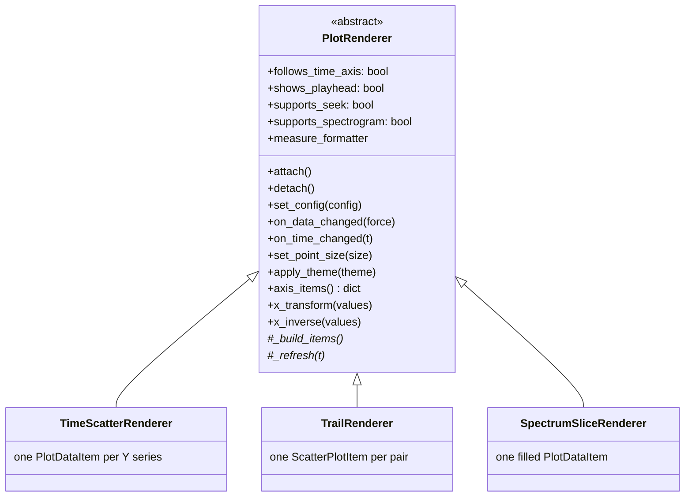
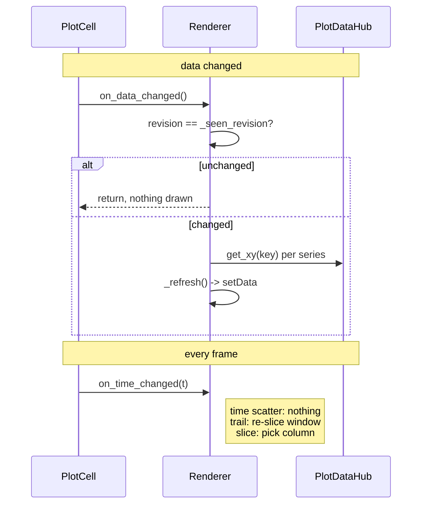

# Renderers

A renderer owns the pyqtgraph items inside one plot and knows how to fill them
from the [`PlotDataHub`](../PlotDataHub.py). `PlotCell` picks one from its
`PlotConfig` and swaps it when the kind changes.

See [`../README.md`](../README.md) for how this fits into the whole layer.



Subclasses implement `_build_items` and `_refresh`. The base class handles the
lifecycle, the revision guard, the colour bar and the viridis sampling.

---

## Capabilities

`PlotCell` reads these flags rather than asking what kind of renderer it has.

| | Time scatter | Trail | Spectrum slice |
|---|---|---|---|
| X axis | time, or 1–N features | a feature | frequency (log) |
| Y axis | 1–N features, or time | a feature | magnitude |
| `follows_time_axis` | yes | no | no |
| `shows_playhead` | yes | no | no |
| `supports_seek` | yes | no | no |
| `supports_spectrogram` | yes | no | no |
| Specialised axis | `TimeAxisItem`, on whichever side time is | none | `FrequencyAxisItem`, bottom |
| Redrawn per frame | no | yes | yes |

`supports_seek` is why clicking the trail plot no longer jumps the playhead to a
nonsense time — the old code interpreted the X coordinate as a timestamp on
every plot.

---

## The update contract



`_refresh` must read through `hub.get_xy(key)` every time. It must **never**
cache a `SignalTimeSeries`: `set_features` replaces those objects, and the old
controllers cached them and went on drawing stale arrays after a re-analysis.

---

## `TimeScatterRenderer`

One item per plotted series — but **which** item depends on whether the plot has
a colour dimension:

| | Item | Clipped / downsampled |
|---|---|---|
| Plain series | `pg.PlotDataItem`, `pen=None`, round symbol | yes |
| Colour-mapped series | `ScatterItem` | no |

`PlotDataItem` is the default because `clipToView` and `autoDownsample` only
apply to it, and these plots routinely hold tens of thousands of frames.

A colour dimension cannot use one. `PlotDataItem` subsets its x/y arrays for
clipping and downsampling but passes `symbolBrush` through whole, so the scatter
underneath ends up with more brushes than points and raises
`Number of brushes does not match number of points`. It is intermittent by
nature: auto-downsampling only kicks in past a few points per pixel, so it
depends on the recording length and the zoom level. Per-point brushes therefore
live on a scatter, which is never subsetted.

Note that `PlotItem.addItem` *overwrites* whatever `clipToView` and
`autoDownsample` were passed to the constructor, using the plot-wide settings.
They have to be applied after the item is added or they silently do nothing.

Because `time` is an exclusive series it is always alone on its axis, so this
renderer is always one time axis against N value series — which is what makes
`y=["F1","F2","F3"]` work with no special cases.

**Orientation.** Time may be on either axis. The renderer reads
`config.time_on_y` and:

- iterates `config.value_specs()` rather than `y_specs()`, so it does not care
  which axis the quantities are on;
- swaps the `setData` arguments — `setData(x=values, y=times)` when transposed;
- returns the `TimeAxisItem` for `'left'` instead of `'bottom'` from
  `axis_items()`;
- reports `Δt` on the vertical axis via `transposed_time_measure_formatter`.

`axis_items()` always returns *both* sides. Moving time from one axis to the
other has to replace the specialised axis and restore a plain one on the side it
came from, so returning only the side that changed would leave a stale
`TimeAxisItem` behind.

When a colour series is set (only possible at one series per axis), point
brushes come from the normalised viridis mapping. If the colour series has no
data yet the renderer falls back to the series' own colour and **still calls
`setData`** — the old code returned early and left the previous frame's points
on screen.

## `TrailRenderer`

Neither axis is time, so the plot shows the last `trail_time` seconds of
history with each point fading out by age:

```
alpha = 255 * (1 - clip((t_now - t_point) / trail_time, 0, 1))
```

One `ScatterItem` per pair. The point count is bounded by the trail window and
every point needs its own brush, so a scatter is the right choice here.

The colour dimension is normalised over the **whole** series rather than the
visible window, so colours do not shimmer as the window slides.

All features share the openSMILE frame timebase, so the window mask is taken
directly on the primary series' timestamps; the second axis is interpolated onto
that basis only as a defence against a length mismatch.

`trail_time` lives in the cell's own `PlotConfig`. In the previous
implementation it was written back into a shared module-level dictionary, so
editing the trail on one plot changed it for every plot using the same preset.

## `SpectrumSliceRenderer`

One filled `PlotDataItem` showing the spectrogram column nearest the playhead:

```
index = argmin(|spectrogram.x - t|)
```

X holds `log10(frequency)` rather than using `PlotItem.setLogMode`.
`FrequencyAxisItem` overrides `tickValues`/`tickStrings` to force a curated tick
list (10, 110, 220, 1k, 5k, 10k); log mode routes through
`logTickValues`/`logTickStrings` instead and calls back into `tickValues` with
already-log-scaled bounds, so the two mechanisms fight each other. Log mode also
would not have helped: `setXRange` and `mapSceneToView` work in log space either
way.

Keeping the transform explicit confines log-awareness to three named places:
`x_transform` (before `setData`), `x_inverse`, and the measure formatter. In the
old code it was scattered across `if spec.get('log_x')` branches in the bounds
setup, the reset and the update path.

### Colouring a spectrum slice

Both the outline and the area under it take the `magnitude` series colour, so
recolouring that series changes the whole curve rather than just its edge.

The colour dimension works here too, and behaves differently depending on what
drives it:

| Colour source | Result |
|---|---|
| *(none)* | The `magnitude` series colour, fill at `FILL_ALPHA` |
| `frequency` — the X axis | Viridis **gradient along the curve** |
| An ordinary series | One viridis tint for the whole curve, changing as the playhead moves |

`frequency` is offered as a colour source only for this kind (see
`PlotConfig.colour_candidates`). It is the axis that actually varies along the
curve — a slice is a single instant, so a time series has just one value there.

Two things this needs care with:

**The gradient goes on the fill only, and the outline is dropped.** A `QPen`
whose brush is a gradient corrupts the curve's bounding rect, which rescales the
axes and mangles the shape. The filled area defines the curve on its own.

**The colour bar gets explicit Hz ticks.** The gradient is linear along the
plot's log-frequency axis, so a linear legend would disagree with what is drawn,
and `ColorBarItem`'s axis renders `inf` in log mode. Instead the bar's levels are
set in the same log space and labelled at the same frequencies as the X axis.

---

## Adding a renderer

1. Subclass `PlotRenderer`; implement `_build_items` and `_refresh`.
2. Set the capability flags and, if the axis is not linear data space, override
   `axis_items`, `x_transform`/`x_inverse` and `measure_formatter`.
3. Add a `PlotKind` in [`../PlotConfig.py`](../PlotConfig.py) and teach
   `PlotConfig.kind` how to derive it from the X selection.
4. Register it in `PlotCell.RENDERERS`.

Import it explicitly — never via `importlib`. PyInstaller resolves this project
by static analysis, with no `hiddenimports` for project code.
